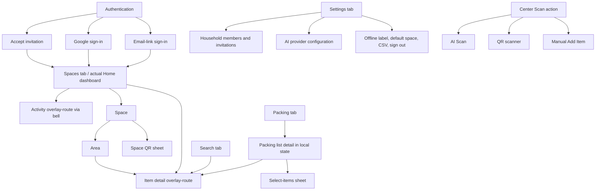

# Stow UI/UX and interaction-design research

**Research date:** July 12, 2026
**Product reviewed:** current Stow PWA in this repository
**Scope:** navigation, information architecture, screen hierarchy, capture, search, location management, item lifecycle, packing, household coordination, feedback, recovery, accessibility, responsive behavior, offline behavior, installation, and update behavior
**Deliverable type:** research and recommendations only; no product changes were implemented

## Evidence labels and method

This report uses four labels deliberately:

- **Verified — implementation:** directly supported by current source or tests.
- **Verified — live:** observed in the running app using a fresh authenticated household in the local Firebase test environment.
- **Usability risk:** a likely problem supported by verified behavior.
- **Inference to test:** a plausible problem that still needs device or user testing.
- **Recommendation:** proposed target behavior.

The earlier product report, `docs/product-research-2026-07-12.md`, was read in full and treated as a hypothesis set. This review then:

1. inventoried routes, screens, overlays, components, data states, and tests;
2. walked the app at a 390×844 phone viewport, 768×1024 tablet viewport, and 1440×900 desktop viewport;
3. created a fresh household, added an item manually, searched, lent and returned it, moved through Packing, inspected Settings and Activity, and opened the scan and QR surfaces;
4. inspected the automated flows for AI, whole-shelf capture, invitation, QR, lending, deletion, offline writes, and PWA behavior; and
5. checked current official competitor and platform sources.

Limits: camera hardware, a real mobile permission prompt, screen readers, an installed iOS/Android PWA, a configured production AI provider, actual invite delivery between two people, and a true offline/reconnect session were not executed end to end. Those behaviors are identified as source-verified or test-backed rather than live-verified. The viewport review is not a substitute for physical-device testing.

---

## 1. Executive summary

Stow’s best idea remains strong: it can become a shared household memory for **where an item belongs, where it is now, and whether it is ready for a trip**. The warm visual system, location-first model, confidence-first shelf review, household activity, lending, QR links, reusable inventory-backed lists, and genuine offline Firestore foundation are worth preserving.

The current interaction system, however, does not yet make those strengths feel reliable. The largest problems are not cosmetic:

1. **Whole-shelf capture communicates success before persistence.** “Confirm & add” changes only local review state; the next screen says items are “filed” even though the database write happens only after the final **Done** tap. Closing that apparent success screen can discard the batch. This is a P0 trust failure in the marquee flow (`src/features/stow/ui/mobile/capture/QuickCapture.tsx:1001-1024,1031-1070,1167-1189`; `src/features/stow/ui/mobile/capture/captureReducer.ts:96-113`).
2. **Sync truth exists in the data layer but is not shown.** The app computes cache and pending-write metadata, yet Settings always says “Synced just now.” Packing and tag changes bypass the guarded offline-write feedback used elsewhere (`src/features/stow/hooks/useWorkspaceData.ts:271-350`; `src/features/stow/ui/mobile/screens/SettingsScreen.tsx:848-867`; `src/features/stow/ui/mobile/StowMobileApp.tsx:381-399,524-528`).
3. **First run creates structure without teaching value.** Authentication silently creates “My Household,” four generic spaces, twelve areas, and disabled AI. There is no goal selection, household naming, vocabulary choice, first-item coaching, or retrieval demonstration (`src/features/household/useHouseholdBootstrap.ts:81-134`; `src/features/stow/seed.ts:224-246`).
4. **The primary navigation reflects implementation categories more than user jobs.** “Spaces” is actually Home; Home already has global search; Search duplicates it; Settings consumes a primary slot; Activity and coordination are hidden behind a bell; and no household switcher exists (`src/features/stow/ui/mobile/shell/BottomNav.tsx:12-17`; `src/features/stow/ui/mobile/screens/HomeScreen.tsx:27-51,70-310`; `src/features/stow/ui/mobile/screens/SearchScreen.tsx:89-111`).
5. **Capture has three overlapping entry models.** The center action, room camera, and Add Item sheet expose different sequences and terms for substantially the same task. AI is prominent even when disabled; offline media is not queued; and camera failure recovery varies by entry point (`src/features/stow/ui/mobile/StowMobileApp.tsx:613-642`; `src/features/stow/ui/mobile/capture/CaptureFirst.tsx:471-503`; `src/features/stow/ui/mobile/add/AddItemSheet.tsx:323-365`; `src/lib/firebase/storage.ts:5-15`).
6. **Packing uses “packed” for two unrelated truths.** A list check and the item lifecycle status `packed` are independent. The global badge sums all unchecked entries across every list, potentially counting the same item multiple times (`src/types/domain.ts:114-126`; `src/features/stow/ui/mobile/StowMobileApp.tsx:131-139`; `src/features/stow/ui/mobile/screens/PackingScreen.tsx:491-510`; `src/features/stow/ui/mobile/screens/ItemDetail.tsx:662-683`).
7. **Household management contains broken promises.** The UI offers OWNER invitations that the server rejects; invite URLs may be lost if clipboard copying fails; accepting a second-household invite overwrites the only active household; and there is no switch or leave flow (`src/features/stow/ui/mobile/screens/SettingsScreen.tsx:23,398-450,655-719`; `functions/src/shared/schemas.ts:110-116`; `functions/src/invites.ts:119-135`).
8. **Desktop and tablet are a framed 440px phone.** The layout intentionally caps the app at 440px and the installed PWA is portrait-locked. This wastes the devices best suited to bulk editing, labels, household administration, search review, and packing-list management (`src/features/stow/ui/mobile/theme/tokens.css:49-65`; `public/manifest.webmanifest:9`).
9. **Feedback is too generic and too optimistic.** Every toast uses a success checkmark, including errors, lasts two seconds, and cannot offer Undo. Ordinary deletions are irreversible while packing-list deletion is a single action-sheet tap (`src/features/stow/ui/mobile/shell/Toast.tsx:4-52`; `src/features/stow/ui/mobile/screens/PackingScreen.tsx:370-390`).
10. **Accessibility foundations are promising but incomplete.** Standard sheets trap focus and support Escape; reduced motion and visible focus exist; many rows are semantic buttons. But full-screen capture, Activity, and Item Detail do not consistently isolate background content; numerous controls are below 44×44; selection state is often visual-only; several filled buttons fail 4.5:1 contrast; and list cards in Packing are not keyboard-operable.

### Direct answers to the central product questions

- **Does navigation match users’ mental model?** Partly. Location browsing does; “Spaces” as the dashboard, duplicated Search, primary Settings, and bell-only Activity do not.
- **Should Search remain a primary tab?** Not as a duplicate input. Convert it to **Browse**, and make the Home search field open that same Browse/search state with the query preserved.
- **Should Settings occupy primary navigation?** No. Settings is a low-frequency utility. Put it under profile/household controls.
- **Where should Activity and household coordination live?** In a primary **Household** destination containing Activity, people, invitations, loans, and household switching. Settings is reached from its header.
- **Are “Space” and “Area” understandable?** They are flexible but abstract. Use **Room or place** and **Shelf, drawer, bin, or spot** in user-facing forms. Keep internal model names until research justifies a unified location tree.
- **Which hidden interactions are most problematic?** Whole-row hold-to-drag, space management available only from Home ellipses, returning a loan through the generic At home status, opening packing lists through a non-semantic card, and the final commit hidden behind Done in shelf capture.
- **Are confirmations overused or underused?** Both. Sign-out and ordinary item deletion can be lower-friction with reversible feedback, while packing-list deletion is under-confirmed. Permanent purge, member removal, ownership transfer, and populated location deletion should remain blocking confirmations.
- **Which destructive actions need soft deletion or Undo?** Items, packing lists, tags, photos, and ordinary empty locations. Populated space/area deletion should use reassignment plus Trash; member removal and ownership transfer require confirmation and cannot rely on a brief snackbar alone.
- **How should multi-item moves work?** Select mode in Browse and container views, then a destination sheet with recents and a location tree; apply one optimistic batch, show a persistent pending marker offline, and provide Review/Retry if reconciliation fails.
- **How should capture continue while work runs?** Save a durable local capture job immediately, return to the camera with **Add another**, and process upload/AI in a background queue. Review uncertainty later, not between every shutter.
- **How should QR scanning transition?** Resolve the code first, then show an object-specific landing state: known container, known item, unassigned label, inaccessible label, or invalid code. The primary actions must change accordingly.
- **What should Home prioritize?** New households: activation steps. Active households: Find, away/due/pending exceptions, and recent changes. Mature households: Find, saved views, active lists, household alerts, and recent locations—not an unfiltered wall of spaces.
- **What belongs in progressive disclosure?** Value, receipts, warranty, serial/model, maintenance, purchase details, custom fields, AI provider internals, and advanced share/permission settings. Name, destination, photo, quantity, and essential status stay primary.
- **What should be redesigned first?** Shelf commit truth, sync truth, activation, navigation/search unification, and reversible destructive feedback.

---

## 2. Current information architecture and navigation map

### 2.1 Route and surface map

**Verified — implementation:** the route set is finite and URL-addressable for spaces, areas, items, Search, Packing, Settings, and Activity; overlays are local React state (`src/App.tsx:19-104`; `src/features/stow/ui/mobile/hooks/useMobileNavigation.ts:40-92,110-181`).

Primary phone navigation is:

`Spaces | Search | [Scan action] | Packing | Settings`

The four named destinations and central action are implemented in `src/features/stow/ui/mobile/shell/BottomNav.tsx:12-17,19-119`.

### 2.2 What each destination actually contains

| Current label | Actual job | Main problem |
|---|---|---|
| Spaces | Home dashboard, inventory totals, global Find, away items, recents, and location browsing | “Spaces” hides the dashboard role and makes Home search feel separate from Search. |
| Search | All-items browser, tag shortcuts, recent terms, list/grid toggle | Query, scope, and history do not carry over from Home; no filters or relevance ranking. |
| Scan | Context-free action chooser for AI, QR, or manual add | Different from room camera and Add Item; not a destination, but visually occupies navigation. |
| Packing | List overview and in-memory selected list | “Packed” collides with item lifecycle; active list has no URL. |
| Settings | Household management, invitation, AI provider, preferences, export, sign out, sync claim | A low-frequency catch-all occupies a primary slot; the most collaborative features are buried here. |
| Activity bell | Latest household changes | No unread state, grouping, filters, pagination, or stable place in IA. |

### 2.3 Current hierarchy and wayfinding findings

- **Verified:** item URLs preserve the source tab and optional space/area in query parameters; direct deep links fall back to Spaces if history has no prior entry (`src/features/stow/ui/mobile/hooks/useMobileNavigation.ts:47-71,95-108,139-153`). This is a strong foundation.
- **Verified:** Packing-list detail is selected in component state, so a list cannot be bookmarked, shared, refreshed, or restored by URL (`src/features/stow/ui/mobile/screens/PackingScreen.tsx:108-181,399-795`).
- **Verified:** Activity is an absolute route overlay while the Home screen remains mounted and readable in the accessibility tree (`src/features/stow/ui/mobile/StowMobileApp.tsx:480-492`; `src/features/stow/ui/mobile/screens/ActivityScreen.tsx:26-36`).
- **Verified:** Item Detail is also an absolute sibling over the mounted screen, without dialog or main semantics (`src/features/stow/ui/mobile/StowMobileApp.tsx:480-500`; `src/features/stow/ui/mobile/screens/ItemDetail.tsx:358-369`).
- **Verified:** space management appears in the Home ellipsis; a space screen itself offers Camera and QR but no visible Manage action (`src/features/stow/ui/mobile/screens/SpacesList.tsx:227-248`; `src/features/stow/ui/mobile/screens/RoomScreen.tsx:153-160`).
- **Usability risk:** a user can understand “I am in Living Room” but still must back out to edit that Living Room.
- **Verified:** no household switcher exists; the data model exposed to navigation has one `currentHouseholdId` (`src/features/household/useHouseholdBootstrap.ts:75-89`; `functions/src/invites.ts:119-135`).

---

## 3. Core user-journey maps

### 3.1 Sign-in and first household creation

**Current verified journey**

`Sign-in wall → Google or email link → automatic “My Household” bootstrap → four seeded spaces / twelve areas → Spaces dashboard`

- **Verified — live:** the unauthenticated screen presents the product name, “Sign in to open your household inventory,” Google, email, and a divider. It does not explain value, image privacy, offline behavior, plan limits, or what happens next.
- **Verified — live:** a new account landed on four fully formed spaces with zero items; there was no household-name or goal step.
- **Verified — implementation:** AI is disabled by default (`src/features/household/useHouseholdBootstrap.ts:110-117`).
- **Risk:** the product creates cognitive debt—someone else’s room structure—before the user has experienced retrieval value.

**Recommended journey**

`Promise and trust → choose goal → name household → review suggested rooms/containers → capture one useful item/area → search for it → optionally invite/install`

Exact first screen:

- headline: **Find anything at home.**
- supporting text: **Photograph a shelf, choose where it belongs, and share the answer with your household.**
- primary: **Get started**
- secondary: **See a sample household**
- trust line: **Your household is private. You control who can see it and how AI processes photos.**

Do not request install or invite until the user has saved or found something.

### 3.2 First-run organization and first item

**Current verified journey**

`Open seeded space → tap room camera or an area → capture-first overlay → Skip or photo/AI → Add Item sheet → name + preselected location → Add`

- **Verified — live:** opening Living Room and tapping its camera silently preselected the first area, Console Drawer. The selection was visible in the subsequent form but not explicitly confirmed before capture.
- **Verified — live:** Add Item correctly hides value, tags, and notes behind **More details**.
- **Risk:** room-level capture can file to the first area by default without the user consciously choosing it.

**Recommendation:** if capture starts at room level and the room has multiple areas, require destination before shutter or show a persistent top chip: **Saving to Living Room › Console Drawer · Change**. For repeated capture, remember the chosen destination for the session, not forever.

### 3.3 Manual, camera-first, single-item AI, and whole-shelf capture

| Mode | Current verified behavior | Break or risk | Target behavior |
|---|---|---|---|
| Manual | Add Item includes photo, name, room, area, and progressive details. | AI action can say “Add a photo first” even when reached from a button labeled Scan with AI (`src/features/stow/ui/mobile/components/PhotoField.tsx:167-212`; `src/features/stow/ui/mobile/add/AddItemSheet.tsx:189-193`). | Make the button start photo selection/camera, then AI. Require only name and destination. |
| Camera-first | Full-screen camera with Photo / AI Scan segment and Skip. | Entry flow differs from center Scan; unsaved draft can be dismissed by X/backdrop in later sheets. | One shared capture shell with visible destination and Draft saved state. |
| Single-item AI | Uploads image and applies suggestion without overwriting user text. | Confidence/rationale are hidden in Add Item; AI is offered when disabled/offline. | Show field-level provenance and uncertainty; disable with explanatory action when unavailable. |
| Whole shelf | Detects items, orders low confidence first, allows confirm/skip, rename, and destination. | “Confirm & add” and “items filed” precede persistence; items lose photos; no duplicate review. | Review uncertainty, then **Add N items**; show real progress; persist crops/context; finish only after local save. |

**Recommended continuous capture state machine**

`Camera ready → shutter → Saved as local job → Add another immediately → background upload → AI complete → Review needed or Ready → batch commit/retry`

The camera must never wait for AI. The queue should remain available from Home and Household/System status.

### 3.4 Create, edit, reorder, and delete spaces/areas

**Current verified journey**

`Home ellipsis → action sheet → edit/rename/move up/down/delete → full Edit Space sheet → manage nested areas → save`

- Long-press on the entire row activates drag after 300ms; moving more than 9px before activation cancels the hold (`src/features/stow/ui/mobile/hooks/useHoldToReorder.ts:40-139`).
- The action sheet provides keyboard/screen-reader-compatible Move up/down (`src/features/stow/ui/mobile/spaces/SpaceActionSheet.tsx:33-50`).
- Pointer cancellation commits rather than cancels; there is no auto-scroll or live announcement.
- Populated space/area deletion requires reassignment, which is a strong safety pattern.
- Add Space and Add Area do not guard against repeated submit while saving.

**Recommendation:** expose a Manage action inside the location; use visible handles in edit mode; keep Move up/down actions; implement true cancel/revert and live announcements. Make ordinary empty-location deletion soft, and keep a dedicated reassignment flow for populated locations.

### 3.5 Find an item from Home, Search, or QR

**Current verified journey**

- Home: type into **Find anything…** → filtered item results replace dashboard content.
- Search: open separate tab → type a separate query → list/grid results.
- QR: scan same-origin space URL → navigate to a space.

**Verified — live:** Search no-results displayed only **No results / Nothing matches “lantern”** and offered no recovery action. Home and Search use different query states. Search results do not expose quick actions.

**Recommendation:** Home Find routes into Browse with the query preserved. Result rows show thumbnail, full breadcrumb, availability, borrower/due state, and an overflow menu. No-result actions:

- **Clear filters**
- **Try “lantern” in notes and tags** if scope was narrow
- **Scan a photo or barcode**
- **Add “lantern”**

QR resolution should distinguish a space, area/container, item, unassigned label, invalid code, and inaccessible/deleted record.

### 3.6 Edit, move, lend, return, change status, delete

**Current verified journey**

`Item detail → inline status OR Edit Item OR Move to another space OR Lent out sheet OR trash icon`

- **Verified — live:** lifecycle buttons are prominent and use pressed state.
- **Verified — live:** lending to “Other” asks for borrower, optional due date, and note; after save, detail showed only **Lent to Sam · just now**.
- **Verified — live:** returning was accomplished by selecting **At home**; toast said **Marked at home**. There was no explicit Return action.
- **Verified:** due date and loan note are visible only by reopening the Lent state; due dates become overdue at the start of their due date because they are stored at local midnight (`src/features/stow/ui/mobile/screens/LendingSheet.tsx:24-27`; `src/features/stow/ui/mobile/screens/AwayStrip.tsx:20-23`).
- **Verified:** Move permits a no-op move to the existing destination and still logs success (`src/features/stow/ui/mobile/screens/ItemDetail.tsx:290-317,567-640`).
- **Verified:** back during editing drops unsaved changes without a dirty-state warning (`src/features/stow/ui/mobile/screens/ItemDetail.tsx:241-255`).

**Recommendation:** when Lent, replace the generic status tile emphasis with an action card:

`Lent to Sam · Due Jul 20`
`[Mark returned] [Edit loan]`

Mark returned should immediately restore At home, preserve loan history, and show **HDMI Adapter returned · Undo**. Due dates should be inclusive through the user’s local day.

### 3.7 Create and complete a packing list

**Current verified journey**

`Packing → New List → inline name field → list card → Add Items sheet → select inventory items → Done → check rows → 1/1`

- **Verified — live:** the empty state presents both **New List** and **New Packing List**, duplicating the same action.
- **Verified — live:** completion moved from 0/1 to 1/1 without a completion transition, next step, or reuse/return action.
- **Verified:** list cards are clickable divs without keyboard semantics (`src/features/stow/ui/mobile/screens/PackingScreen.tsx:234-241`).
- **Verified:** Delete is one destructive action-sheet tap with no confirmation or Undo (`src/features/stow/ui/mobile/screens/PackingScreen.tsx:370-390`).
- **Verified:** list check state and item lifecycle Packed are independent.

**Recommendation:** list detail has three explicit phases:

1. **Plan** — choose items; unavailable items are explained.
2. **Pack** — check items; progress is “12 of 15 checked.”
3. **Complete** — **All checked. Start trip?** with **Mark checked items away for Weekend Trip** as an optional explicit transition.

On return, **End trip** opens a reconciliation checklist and restores each item to its home location/status.

### 3.8 Invite and manage household members

**Current verified journey**

`Settings → optional email restriction + role → Create invite → best-effort copy → pending row`

- OWNER appears as a role even though the backend rejects owner invites.
- An admin can see role/member choices the backend forbids.
- A clipboard failure can lose the only presentation of a new link; pending rows cannot re-copy it.
- Accepting a second household replaces current household context; there is no switcher or Leave Household.

**Recommendation:** role options must be derived from actor permissions. After creation, show a durable invite card with **Copy link**, **Share**, **Restrict email**, **Expires**, **Regenerate**, and **Revoke**. Ownership transfer is a separate, confirmed workflow. Household switching belongs at the top of Household, before people/settings.

### 3.9 Review activity

**Current verified journey**

`Home bell → Activity overlay-route → latest 50 rows → tap an item/space-linked row`

- No unread state, filter, grouping, pagination, or item/location-specific history.
- Deleted-item events remain clickable and route to a missing item.
- **Verified — live:** underlying Home content remained present in the accessibility snapshot while Activity was open.

**Recommendation:** Activity becomes the first segment in Household: **Activity | People | Loans**. Rows group by Today/Yesterday/Older and support filters. Deleted targets open a historical row/detail state, not a broken live item.

### 3.10 Work offline and reconnect

**Current source-verified journey**

`navigator reports offline → global passive banner → Firestore writes apply locally → toast says will sync → reconnect → Firestore syncs silently`

- Firestore uses persistent multi-tab caching (`src/lib/firebase/client.ts:23-28`).
- Storage uploads reject immediately offline (`src/lib/firebase/storage.ts:10-15`).
- Snapshot metadata tracks cache and pending writes, but the UI does not use it.
- `navigator.onLine` can report online while the server is unreachable, leaving an awaited acknowledgment hanging (`src/lib/firebase/completeWrite.ts:6-12`).
- Packing and tag mutations do not use the same guarded feedback as item/space mutations.

**Recommendation:** replace the vague offline banner with a calm, stateful system:

- **Offline · Changes save on this device**
- **3 changes waiting to sync**
- **Syncing 3 changes…**
- **All changes synced · 2:41 PM**
- **1 change needs attention · Review**

Metadata edits remain available. Photo/AI actions say **Needs a connection** before the user starts, with **Save without photo** or **Add to capture queue** if durable blob queuing is implemented.

### 3.11 Install and update the PWA

**Current source-verified journey**

- install prompt/banner appears whenever `beforeinstallprompt` is available;
- iOS Safari displays a passive install instruction whenever not standalone;
- update checks run hourly and a banner offers immediate refresh;
- the installed app is portrait-locked.

Evidence: `src/lib/pwa/usePwaInstall.ts:13-55`; `src/routes/StowMobileRoutePage.tsx:71-86`; `public/manifest.webmanifest:1-13`.

**Recommendation:** request installation after first value, remember dismissal, and keep **Install Stow** in Settings. Update banner copy: **Update ready** with **Update now** and **Later**; never refresh while a form or capture draft is dirty. Remove the orientation lock.

---

## 4. Screen-by-screen UX audit

### 4.1 Authentication and auth completion

**Preserve:** simple Google/email paths; disabled button during request; email-link completion fallback (`src/features/auth/AuthGate.tsx:57-120`; `src/routes/AuthFinishPage.tsx:89-97`).

**Problems:** no value proof or privacy context; form labels rely on placeholders; status messages are not consistently live; **Use Another Email** clears the field but not the prior success message (`src/features/auth/AuthGate.tsx:113-119`).

**Recommendation:** add promise/trust/demo content, persistent email labels, and a truthful email-link state with **Change email** that clears both field and status.

### 4.2 Home / “Spaces”

**Preserve:** Find is prominent; recents and Away are useful; location counts are clear; first-level rows are semantic and visually calm.

**Problems:** wrong destination name; visible household name is absent; mature Home is dominated by every space; management hints sit below the entire list; Home search duplicates Search; initial loading can briefly appear as a real empty household.

**Recommendation:** rename to Home; show household switch/name in the header; use state-aware modules; preserve cached content or skeletons until subscriptions are ready; route query into Browse.

### 4.3 Space and area view

**Preserve:** exact breadcrumb context, area counts, item list, Camera and QR access.

**Problems:** no in-context Manage action; Space-level QR is too coarse; room-camera capture may default to the first area; no bulk selection or area-level label.

**Recommendation:** header menu: **Manage room/place**, **Print label**, **Select items**, **Add area**, **Refresh with photo**. Area rows get **Add here** and label/refresh actions.

### 4.4 Search / Browse

**Preserve:** all-item mode before typing; list/grid persistence; popular/recent concepts; complete location breadcrumb.

**Problems:** “Popular Tags” is every tag, unsorted and uncapped; two-character partial terms are saved after 450ms and cannot be cleared; substring matching has no relevance or typo tolerance; notes/status/borrower are excluded; no filters, result quick actions, or recovery path (`src/features/stow/ui/mobile/screens/SearchScreen.tsx:25-59,103-111,215-235`).

**Recommendation:** Browse has `All | Locations | Saved` segments, filter chips for Status/Location/Person/Tag, relevance/sort, and selection mode. Search suggestions do not become history until a result is opened or the query is submitted.

### 4.5 Item detail

**Preserve:** strong location card; status visibility; progressive sections; edit/move actions; URL-addressable detail.

**Problems:** top pack icon duplicates the Packed status; move is a full replacement view even for a quick task; loan due/note are hidden; no history; destructive delete has no recovery; background screen remains exposed to assistive technology; long location/name text is truncated.

**Recommendation:** one overflow menu and a stable bottom action row tailored to state. Default actions: **Move**, **Lend**, **Add to list**. When Lent: **Mark returned**, **Edit loan**. Put delete under overflow and send to Trash with Undo.

### 4.6 Add/Edit Item

**Preserve:** More details disclosure; user text wins over AI; photo can be added independently.

**Problems:** visual-only selected chips; More details lacks `aria-expanded`; offline upload failure may be silent; capture and AI actions overlap; sheet can dismiss dirty work by backdrop; focus may reset when local `onClose` changes.

**Recommendation:** persistent draft, labeled radio groups, a visible destination summary, inline error/retry, and dirty dismissal confirmation only when the draft cannot be recovered.

### 4.7 Packing overview, detail, and picker

**Preserve:** canonical inventory reuse; simple progress; searchable selection grouped by location.

**Problems:** duplicate empty-state CTAs; non-semantic list card; ambiguous Clear all; visual-only selection; 26px check target; no availability warning, quantities, duplication/reuse, list URL, completion, or return flow.

**Recommendation:** one **New list** CTA, semantic cards, **Uncheck all** label, 44px checks, real checkboxes/pressed state, availability summary, Duplicate/Re-use, and URL-addressable list IDs.

### 4.8 Activity

**Preserve:** human actors, concise summaries, relative time, deep links.

**Problems:** hidden behind bell; no unread marker; no filters/history depth; background not inert; deleted target links break; relative times do not update until render.

**Recommendation:** Household destination, grouped feed, unread state, filters, object history, and historical deleted-object details.

### 4.9 Settings and household management

**Preserve:** roles are visible; email-restricted invitations are supported; owner protection exists; export and default space exist.

**Problems:** crowded catch-all; invalid role choices; lost invite link; no switch/leave; AI provider internals dominate; non-admins see misleading/partly editable AI state; Test connection ignores unsaved values; local-only default space is unexplained; sync/version text is hard-coded.

**Recommendation:** split into Household and Settings. Main AI section: `AI scanning On/Off`, hosted allowance, privacy note, test scan. Put provider/model/key/temperature/tokens under **Advanced · Bring your own AI provider**.

### 4.10 Capture overlays

**Preserve:** dedicated camera presentation; low confidence is not color-only; shelf review is uncertainty-first; camera/library fallback code exists; capture background is inert in most root flows.

**Problems:** full-screen overlays do not share Escape/trap/restore behavior; busy/error text lacks live semantics; central Scan did not expose a visible recovery while camera access remained unresolved in the live browser; three entry models differ; shelf success is premature; no crop retention or duplicate step.

**Recommendation:** one full-screen capture shell, one permission state machine, persistent destination, live status region, capture queue, and commit-true review.

### 4.11 Invitation acceptance and missing/deleted deep links

**Preserve:** invitations and entities are URL-addressable; missing spaces explain that a QR may be stale.

**Problems:** generated invite URL lacks the optional human context the acceptance page knows how to render; accepting overwrites current household; invalid item link in an otherwise empty household can silently fall through; deleted Activity links remain active.

**Recommendation:** invite page shows household, inviter, role, expiry, current active household, and **Join and switch / Join, stay here**. Missing/deleted entities render explicit recoverable states regardless of collection length.

---

## 5. Feature-by-feature interaction audit

| Feature | Verified current behavior | Main risk | Recommended interaction |
|---|---|---|---|
| Location hierarchy | Household → Space → Area → Item | Space/Area vocabulary is abstract; depth may be insufficient for some storage. | User labels Room/place and shelf/drawer/bin/spot now; test actual depth before a unified tree. |
| Home search | Filters name, tags, space, area | “Find anything” overpromises; duplicate state. | One global query feeding Browse; include notes, status, borrower, quantity, OCR later. |
| Reordering | Whole-row hold drag plus Move up/down | Hidden, conflicts with scroll, cancel commits. | Visible handle/edit mode, pointer capture, true cancel, auto-scroll, live result, alternatives. |
| Manual item | Short default form with optional details | Destination can be accepted passively; offline photo errors inconsistent. | Explicit destination chip, minimal required fields, durable draft, inline media state. |
| Single-item AI | Suggests name/tags/notes and preserves user entries | AI availability/provenance/uncertainty unclear. | Field-level suggestions with confidence and accept/edit controls; managed default. |
| Whole shelf | Low-confidence-first review and batch creation | Premature success, no item crops, no duplicates/partial failure. | Review → Add N items → real commit summary; retain crops/context; duplicate/partial-failure groups. |
| QR labels | Generate/share/copy PNG for a space; same-origin scan | Too coarse, error can look like infinite generation, no label lifecycle. | Stable area/container identity, printable label flow, assignment/reassignment states. |
| Item status | At home, Packed, Lent, Repair, Missing | Packed conflicts with list; Return is hidden. | At home, Away/With trip, Lent, Repair, Missing; explicit Return/Trip transitions. |
| Lending | Member or external borrower, date, note | Self appears as borrower; due/note hidden; overdue at midnight. | Exclude self by default, show due/note, inclusive dates, reminders, explicit return. |
| Packing | Inventory-backed list and independent checks | Unavailable items ignored; completion dead-ends; destructive delete unsafe. | Plan/Pack/Complete phases, availability, Undo, reuse, trip start/end. |
| Activity | Latest 50, actors, deep links | No unread/filter/history; deleted links break. | Household action center plus item/location history. |
| Members | OWNER/ADMIN/MEMBER and restrictions | UI/server mismatch; no viewer/guest; no switch/leave. | Permission-derived actions, Viewer/Guest/Editor, switching, scoped/expiring share. |
| Offline | Persistent Firestore, optimistic writes, banner | Media not queued; pending truth hidden; guarded behavior inconsistent. | Durable queue and per-operation states; metadata/media capabilities explained before action. |
| PWA | install/update banners, service worker, safe areas | Premature and non-dismissible install; portrait lock; update can interrupt work. | Prompt after value; Later; dirty-work protection; landscape support. |
| Export | CSV from Settings | Buried; no import/full backup. | Data & privacy center with CSV, JSON/ZIP, import, last backup, delete/export explanations. |

---

## 6. Overlay and feedback-system audit

### 6.1 Current inventory

| Pattern | Current examples | Verified behavior |
|---|---|---|
| Alert dialog | Item delete, Settings confirmations | `role=alertdialog`, modal, focus trap, Escape, focus restore through `useDismissable` (`src/features/stow/ui/mobile/shell/Confirm.tsx:20-101`). |
| Bottom sheet | Add Item, Add Space, Add Area, Lending, QR, Edit flows | `role=dialog`, backdrop dismissal, max 86% height, close button, trap/restore (`src/features/stow/ui/mobile/shell/Sheet.tsx:16-90`). |
| Action sheet | Scan chooser, space/list actions | Modal dialog, Cancel, 3–6 actions, backdrop dismissal (`src/features/stow/ui/mobile/shell/ActionSheet.tsx:24-136`). |
| Full-screen dialog | camera, AI, QR, capture-first, shelf review | Visually modal and often `aria-modal`; inconsistent Escape/trap/restore and status semantics. |
| Route overlay | Activity, Item Detail | Absolute sibling over mounted screen; background remains available to assistive technology. |
| Toast | add/move/status/delete/error feedback | Two-second text-only API, always a success checkmark, no action (`src/features/stow/ui/mobile/shell/Toast.tsx:4-52`). |
| Banner | offline, install, update, listener/access error | Global `aria-live`; global banners can layer above capture; errors have limited action. |
| Inline validation | some disabled submit states and messages | Inconsistent labels, field association, and server-bound validation. |

### 6.2 Dialog audit

**Strength:** the shared confirmation primitive has the right semantic baseline.

**Problems:** no busy/disabled API; a repeated tap can repeat a destructive action; background inertness is not systemic; permanent confirmations are used where soft deletion would be safer and faster.

**Use dialogs for:** ownership transfer, member removal, final Trash purge, populated location deletion/reassignment, discarding an unrecoverable dirty draft, and conflict resolution that blocks forward progress.

**Do not use dialogs for:** ordinary item/list deletion if Trash + Undo exists, successful save, status change, a routine move, sign out when no unsynced work exists, or informational errors.

### 6.3 Bottom sheets

**Problems:** backdrop always closes, even with dirty input; the decorative handle implies swipe-to-dismiss but has no gesture; close targets are 32×32; focus can reset when unstable `onClose` functions change (`src/features/stow/ui/mobile/shell/useDismissable.ts:10-17,47`).

**Recommendation:**

- use bottom sheets for short forms or destination/selection tasks on phone;
- use a side panel or centered dialog at wider breakpoints;
- make dirty drafts persistent; otherwise intercept dismiss with **Save draft / Discard / Keep editing**;
- make the handle draggable or remove its affordance;
- provide a 44×44 close hit target;
- stabilize close callbacks and focus only once per open cycle.

### 6.4 Action sheets and menus

**Strength:** labels are clear and destructive rows are visually differentiated.

**Problems:** on desktop, a bottom action sheet is spatially disconnected from the ellipsis that opened it; packing delete executes directly; ActionSheet actions do not automatically close, relying on every caller.

**Recommendation:** phone uses action sheets; tablet/desktop use anchored menus. Action menu order:

1. most likely contextual action;
2. related actions;
3. divider;
4. destructive action last.

Each action must either close on selection or enter a clearly nested surface. Destructive actions that go to Trash can execute and show Undo; irreversible actions open a dialog.

### 6.5 Toasts, snackbars, and banners

**Current failure:** “Couldn’t…” messages still show a checkmark and disappear after two seconds.

**Recommendation taxonomy:**

- **Toast, 3–4 seconds:** confirmed, noncritical success only. Example: **Name updated**.
- **Undo snackbar, 8–10 seconds:** reversible mutation. Example: **HDMI Adapter moved to Garage › Bin 4 · Undo**.
- **Persistent warning/error banner:** failure, offline/pending work, revoked access, or cross-screen issue. Include **Retry**, **Review**, or **Dismiss**.
- **Inline status:** upload/AI/form state local to one field or card.

Snackbar timers pause on hover/focus, the action is keyboard reachable, and status is announced once. Do not let a global install/update banner appear above an active camera.

### 6.6 Inline validation

Every field error should:

- remain next to the field;
- identify what is wrong in plain language;
- be linked with `aria-describedby`;
- preserve the entered value;
- focus the first invalid field only after submission; and
- distinguish client validation from server failure.

Examples:

- **Model is required. Example: gemini-2.5-flash.**
- **Temperature must be between 0 and 1.**
- **This invite role is not available to Admins.**
- **Photo could not upload. Keep the item without a photo, or retry when online.**

### 6.7 Confirmation balance by action

| Action | Current | Recommended |
|---|---|---|
| Delete one item | Blocking confirm, irreversible | Move to Trash immediately + 10s Undo; confirm permanent purge only. |
| Delete packing list | One action-sheet tap | Trash + Undo; if no Trash, confirm with list name and item count. |
| Remove tag/photo | Immediate | Immediate + Undo. |
| Change status / return | Immediate | Immediate + Undo; explicit state-specific copy. |
| Delete empty area/space | Blocking management flow | Trash + Undo. |
| Delete populated area/space | Reassignment flow | Keep blocking reassignment; summarize item counts and final destinations. |
| Remove household member | Confirmation | Keep; show lost access and transfer of owned responsibilities. |
| Transfer ownership | Not a distinct flow | Dedicated confirmation requiring target and explicit acknowledgement. |
| Sign out | Confirmation | No confirm unless pending/unsynced work; otherwise sign out directly. |
| Discard unsaved capture | X can discard | Save draft automatically; confirm only if draft recovery is impossible. |

---

## 7. Drag-and-drop and reordering recommendations

### 7.1 Current behavior

**Verified:** space rows bind pointer events to the full navigational row. Holding for 300ms activates drag; movement over 9px before activation cancels the hold; vibration is attempted; the reordered list is committed on pointer up (`src/features/stow/ui/mobile/hooks/useHoldToReorder.ts:40-139`; `src/features/stow/ui/mobile/screens/SpacesList.tsx:91-115`). A text hint below the complete list teaches the gesture (`src/features/stow/ui/mobile/screens/SpacesList.tsx:279-297`).

**Verified strengths:** the ellipsis action sheet includes **Move up** and **Move down**, and area management has explicit movement buttons (`src/features/stow/ui/mobile/spaces/SpaceActionSheet.tsx:33-50`; `src/features/stow/ui/mobile/spaces/EditSpaceSheet.tsx:620-637`). The product therefore does not rely exclusively on drag.

**Verified defects and risks:**

- `reorderIndex` assumes equal-height rows (`src/features/stow/ui/mobile/hooks/useHoldToReorder.ts:4-17`). Text scaling or wrapped labels can invalidate the math.
- Pointer cancellation commits the partially changed order instead of restoring it (`src/features/stow/ui/mobile/hooks/useHoldToReorder.ts:128-137`).
- There is no pointer capture, edge auto-scroll, Escape cancellation, live announcement, or explicit dropped-position feedback.
- Whole-row long press conflicts with the row’s primary action and with scrolling.
- The visible grip appears only after drag starts, so it cannot teach how to start.
- The hint may be below the fold and uses touch-only language on mouse/keyboard devices.

### 7.2 Recommended behavior by input

#### Touch

1. A visible 44×44 drag handle appears in **Manage order** mode; ordinary browse mode remains tap-to-open.
2. Touching the handle for 180–250ms activates with a small haptic and lift animation.
3. Moving near the top/bottom auto-scrolls at a speed proportional to edge distance.
4. The prospective drop gap is explicit; sibling rows shift around it.
5. Lifting commits locally and announces **Moved Garage to position 2 of 4**.
6. A 10-second snackbar offers **Undo**.

Do not require long-press on the entire row. If long-press is retained as a shortcut, it must enter the same explicit reorder mode and never be the only path.

#### Mouse and trackpad

- The handle shows a grab cursor and begins immediately on pointer down + movement; no long hold.
- Use pointer capture so leaving the row or app frame does not lose state.
- Edge auto-scroll and drop indicators match touch.
- Right click is not required; ellipsis menu retains Move up/down and **Move to position…**.

#### Keyboard

Preferred model:

- Tab to the handle.
- Space enters grabbed state: **Garage grabbed, position 4 of 4. Use arrow keys to move; Escape to cancel.**
- Arrow Up/Down changes the preview position.
- Home/End move to first/last.
- Space or Enter drops.
- Escape restores the original order.

Retain Move up/down menu items for users who prefer an action-based model.

#### Screen readers and switch access

- Handle accessible name: **Reorder Garage**.
- Use `aria-pressed` or an equivalent grabbed-state description; do not depend on deprecated attributes alone.
- Announce every confirmed movement in a polite live region, but avoid announcing every pixel/hover change.
- Provide **Move before… / Move after… / Move to first / Move to last** in a dialog for deterministic access.

### 7.3 Cancellation and failure

- `pointercancel`, lost capture, Escape, route change, and app backgrounding restore the original order.
- Reordering is locally optimistic. While offline, each affected row may show a subtle cloud/pending marker and the system banner says **1 order change waiting to sync**.
- If the server rejects the write, restore the last server order only after explaining the conflict: **Garage order couldn’t sync. Keep local order and retry / Use household order.**
- Concurrent edits use stable fractional or sortable positions; the UI should not silently jump while a user is dragging.

### 7.4 Multi-item and container movement

Add **Select** to Browse, space, and area menus. Selection mode provides:

- checkboxes and count: **3 selected**;
- actions: **Move**, **Add to list**, **Tag**, **Change status**, **Archive**;
- **Select all results** distinct from **Select visible**;
- a destination sheet with **Recent**, **Current household**, and searchable Room/place → Storage spot hierarchy;
- summary before commit: **Move 12 items to Garage › Camping Bin**;
- one local batch and one Activity summary, not 12 noisy global rows.

If a container becomes first-class, moving it should preserve contained items and stable QR identity. The printed label identifies the container, not a location string that becomes stale.

---

## 8. Recommended navigation and information architecture

### 8.1 Proposed phone navigation

```mermaid
flowchart TD
  HOME["Home"] --> FIND["Global Find"]
  HOME --> EX["Away, overdue, missing, pending"]
  HOME --> REC["Recents and active locations"]
  BROWSE["Browse"] --> ALL["All items"]
  BROWSE --> LOC["Locations"]
  BROWSE --> SAVED["Filters and saved views"]
  ADD["Central Add action"] --> ONE["One item"]
  ADD --> SHELF["Shelf / box"]
  ADD --> QR2["QR label"]
  ADD --> MAN2["Manual"]
  LISTS["Lists"] --> KIT["Packing / reusable kits"]
  HOUSE["Household"] --> ACT2["Activity"]
  HOUSE --> PEOPLE["People and invitations"]
  HOUSE --> LOANS["Loans"]
  HOUSE --> SWITCH["Switch household"]
  HOUSE --> SETTINGS["Settings"]
```

Phone bar:

`Home | Browse | [Add] | Lists | Household`

This preserves the familiar five-slot composition but makes every named slot a frequent user job. The center Add control remains an action and should use a label in its expanded/action-sheet state.

### 8.2 Search decision

Search remains primary as a **capability**, not as a duplicated destination.

- Home contains the visible **Find items, rooms, tags…** field.
- Focusing or typing routes to Browse with the query in the URL: `/browse?q=hdmi`.
- Browse owns results, recent searches, suggestions, filters, sorting, selection, and saved views.
- Back returns to Home with the query preserved if that is where the search began.
- A mature desktop layout keeps the query in the top bar across destinations.

### 8.3 Settings decision

Settings leaves primary navigation. It is reached from:

- the Household header gear/avatar;
- the household switcher menu;
- contextual links such as **Set up AI scanning**, **Install Stow**, or **Review sync issue**.

Settings sections:

1. Account and appearance
2. Household preferences and vocabulary
3. Capture and AI
4. Labels and scanning
5. Notifications
6. Offline and sync
7. Data, export, and privacy
8. Advanced provider settings

### 8.4 Activity and coordination decision

Household is primary because coordination is central to Stow’s differentiated loop. Its default segment is Activity, with prominent exceptions:

- overdue loans;
- invitations awaiting action;
- changes needing sync review;
- items marked missing;
- active trip/list state.

This destination can justify an unread badge; Settings cannot.

### 8.5 Location language

Recommended user-facing fields:

- **Room or place** — “Garage,” “Kitchen,” “Storage unit,” “Camper.”
- **Shelf, drawer, bin, or spot** — “Top shelf,” “Tote 4,” “Workbench,” “Console drawer.”

Current “Space” and “Area” can remain internal types. Display nouns can be derived from an optional location type:

`room | place | zone | shelf | drawer | bin | cabinet | box | other`

Do not expose arbitrary nesting until testing shows repeated failures with the two-level model. First make Area a first-class container: own QR, photo, history, refresh, and move.

### 8.6 Responsive IA

| Window | Navigation | Content pattern |
|---|---|---|
| Compact phone (<600px) | bottom bar + center Add | single route/sheet/full-screen capture |
| Short landscape | side/compact rail or two-row top controls | camera preview beside controls; no portrait lock |
| Tablet (600–1023px) | navigation rail | two-pane Browse/location list + detail; sheets become side panels |
| Desktop (≥1024px) | persistent sidebar + global search | 960–1200px workspace, multi-select, bulk tools, labels/settings tables |
| Installed PWA | same adaptive rules | safe areas, standalone title behavior, update/sync status |

Destination labels and order stay stable across sizes; only the navigation component changes.

---

## 9. Recommended interaction rules and component taxonomy

### 9.1 Core rules

1. **Never report completion before local durability.** “Saved,” “added,” “filed,” and a checkmark mean the record can survive closing the surface.
2. **Never hide connectivity consequences.** Say what works offline before the user enters a media/AI flow.
3. **Prefer reversible action over interruptive confirmation.** Trash + Undo for ordinary deletion; dialog for irreversible or cross-person impact.
4. **One job, one canonical flow.** Center Add, room-camera Add, and item-sheet AI should enter one capture state machine with context prefilled.
5. **Preserve context across surfaces.** Queries, selected destination, list, and scroll state should survive back navigation.
6. **Visible actions must match permissions and capability.** Do not offer OWNER invite or Whole Shelf if the actor/provider cannot complete it.
7. **Status words have one meaning.** A list check is not an item lifecycle state.
8. **Every gesture has a visible, keyboard, and screen-reader equivalent.**
9. **Errors are local first, global only when cross-screen.**
10. **Background work is inspectable.** Uploads, AI, and sync live in one durable Jobs/Sync queue.

### 9.2 Pattern selection matrix

| Pattern | Use when | Do not use when | Required behavior |
|---|---|---|---|
| Inline control | one field/state changes in place | change needs multi-step context | optimistic update, local status, accessible selected state, Undo where harmful |
| Anchored menu | 3–7 contextual actions on pointer devices | phone has too little space | opener relationship, arrow/Escape behavior, destructive last |
| Action sheet | same short contextual actions on phone | form or multi-step choice | clear title when object-specific, Cancel, focus trap, close after action |
| Bottom sheet | short form, selection, or destination on phone | camera, long edit, complex review | labeled dialog, 44px controls, safe-area padding, dirty-state handling |
| Side panel | tablet/desktop equivalent of a sheet | task changes the main object/context | preserve underlying list context, resizable only if useful |
| Full screen | camera, shelf review, first-run wizard, complex editor | one confirmation or quick selection | explicit Back/Close, persistent draft, focus isolation, progress and cancel |
| Dialog | irreversible/high-impact decision or conflict | ordinary success/error or undoable deletion | concise consequence, named object, safe default focus, busy lockout |
| Toast | confirmed noncritical success | failure, pending, undo, or required action | success icon only, 3–4s, polite status |
| Undo snackbar | reversible mutation | permanent/cross-person action | 8–10s, keyboard action, pause timer on focus/hover |
| Banner | offline/pending/system issue across screens | single field problem | persistent state, action, calm copy, no modal overlap |
| Inline validation | a field is invalid or upload failed | entire service unavailable | adjacent copy, value preserved, described-by relationship, retry |
| Skeleton/cached state | known layout is loading | indefinite unknown operation | never impersonate a real empty state; respect reduced motion |

### 9.3 Animation and perceived performance

- Keep current reduced-motion suppression (`src/styles.css:379-385`; `src/features/stow/ui/mobile/theme/tokens.css:167-170`).
- Limit navigational motion to 180–280ms; use opacity/translate without large parallax.
- On capture, shutter feedback is immediate even if no network request has started.
- Skeletons appear within about 300ms; cached content stays visible with **Updating…**.
- Determinate progress is used for known job counts: **Uploading 2 of 7**.
- Indeterminate animation always has status text.
- A completion animation never blocks the next action and is omitted under reduced motion.

---

## 10. Detailed feature recommendations

### 10.1 Capture and AI

#### Canonical Add sheet

Center Add menu:

1. **One item** — camera/photo/manual review
2. **Shelf, drawer, or box** — multi-item capture
3. **Scan QR label**
4. **Add manually**

Optional future rows appear only when supported: **Barcode**, **Receipt/document**.

When launched from a location, top copy reads **Adding to Garage › Camping Bin** with **Change**. When launched globally, destination selection happens before final save, not necessarily before shutter.

#### Background capture queue

After shutter:

- store original/downscaled blob and job metadata locally;
- show **Saved to capture queue**;
- return to camera with **Add another** and **Review queue**;
- upload when connectivity permits;
- run AI asynchronously;
- show queue state: `Waiting for connection | Uploading | Analyzing | Review needed | Ready | Needs attention`.

Closing the app cannot lose a locally accepted capture. Queue jobs show retry and discard; discarding a processed job is an explicit reversible action.

#### AI uncertainty

Each suggestion carries a visible confidence tier and reason:

- **High confidence** — preselected; user can edit.
- **Check this** — field highlighted with why: “Two similar black adapters detected.”
- **Couldn’t identify** — empty name with crop/context and a quick text field.

For single-item AI, show provenance next to changed fields: **Suggested by AI**. Do not apply a suggestion after the user has edited that field; the existing `applyVisionSuggestion` behavior is worth preserving (`src/features/stow/ui/mobile/capture/applyVisionSuggestion.ts:15-41`).

#### Duplicate handling

Before commit, group likely duplicates:

`Possible duplicate: HDMI Adapter already in Office › Cable Drawer`
`[Keep both] [Update existing] [Not the same]`

Never silently merge. Confidence is a hint, not a decision.

#### Whole-shelf commit correction — highest priority

Replace the current sequence with:

1. review card action: **Confirm** (not “Confirm & add”);
2. after all cards: summary **7 ready · 2 skipped · 1 possible duplicate**;
3. primary: **Add 7 items**;
4. commit state: **Saving items… 4 of 7** with Cancel disabled once the atomic write begins, or Cancel meaning **Continue in background**;
5. success only after local durability: **7 items added to Garage › Top shelf**;
6. actions: **View items**, **Add another shelf**, **Done**.

If persistence is atomic, a failure says **No items were added** with Retry. If jobs are independently persisted, show **5 added · 2 need attention**, list failures, and preserve successful items.

Save per-item crops or a compressed context image + bounding box. Do not show the same shelf thumbnail on summary rows if committed items will be text-only.

### 10.2 Search and browsing

Search index should cover:

- name, alternate name, tags, notes;
- live room/place and container names rather than stale snapshots;
- lifecycle status;
- borrower and loan note;
- serial/model/barcode when introduced;
- OCR/manual document text only with a visible scope and privacy explanation.

Result row:

`[thumb] HDMI Adapter`
`Living Room › Console Drawer`
`At home` or `Lent to Sam · due Jul 20`
`[More]`

More menu: **Move**, **Mark returned** when lent, **Add to list**, **Edit**, **Archive**.

Filters are chips with removable state and a **Clear all** control. Sorting defaults to relevance while searching, Recently updated when browsing. Typo tolerance should explain itself only when needed: **Showing results for “lantern.” Search “lanturn” instead.**

### 10.3 Spaces, areas, containers, and labels

- Keep the two-level model near term, but make areas first-class.
- An Area gets its own photo, QR identity, short code, history, selected-items mode, and **Refresh with photo**.
- Add Space form asks **Room or place name** and optionally **Add shelves, drawers, bins, or spots** with one chip per entry rather than a single comma-separated parsing field.
- After creation, show **Garage created · Add items** and **Print a label** as next steps.
- Location management saves as one transaction or clearly reports partial completion; repeated submit is disabled while saving.
- Rename display should resolve from live location records or cascade snapshots transactionally.

Label workflow on tablet/desktop:

1. choose containers or unassigned codes;
2. choose sheet/template and starting cell;
3. preview name, stable short code, optional icon/color;
4. **Print test label**;
5. **Print N labels**;
6. remember template per device.

### 10.4 QR scanning

State-specific resolution:

| Scan result | Screen | Primary actions |
|---|---|---|
| Known container/area | container landing | **Add here**, **View contents**, **Refresh with photo** |
| Known space/room | location landing | **Choose area**, **Add item**, **View all** |
| Known item | item detail | state-aware **Move/Return/Lend/Add to list** |
| Unassigned Stow label | assignment flow | **Assign to existing container**, **Create container** |
| Deleted/archived target | recovery | owner: **Restore/Reassign label**; member: explain unavailable |
| Another household | access state | **Switch household** if member; otherwise request access guidance |
| Non-Stow or invalid code | safe fallback | show domain/summary, never navigate silently; **Try again** |

The camera screen has a visible **Enter or paste code** fallback from the start, not only after permission failure. Permission-denied copy links to browser instructions and offers photo-library QR decoding where supported.

### 10.5 Item detail and editing

Default item form:

- photo;
- name;
- quantity if validated as common;
- destination;
- tags;
- state only when not At home.

Collapsed sections:

- **Details** — notes, value, serial/model;
- **Proof & documents** — receipt, warranty, manual;
- **History**;
- **Advanced** — custom fields, identifiers.

Save common lifecycle operations inline; use a full edit screen for metadata. When a user leaves with dirty changes, autosave a draft or ask **Keep editing / Discard changes**. A no-op move is disabled with **Already here**.

Deletion target:

`Archive item` in overflow → item disappears from active views → snackbar **HDMI Adapter archived · Undo** → Trash retains 30 days → permanent delete confirms photo/document loss.

### 10.6 Lending and returning

- Exclude current user from household borrower suggestions; provide **Someone else**.
- Borrower sheet includes due date as optional and explains reminders.
- Item detail and Away strip show borrower, inclusive due date, and note indicator.
- Overdue copy: **Due today**, **1 day overdue**, never simply a red date.
- Actions: **Mark returned**, **Extend due date**, **Contact** only if contact data and permission exist.
- Mark returned preserves a loan-history event, changes status to At home, and offers Undo.
- Household Loans view groups **Overdue**, **Due soon**, **No due date**, and **Recently returned**.

### 10.7 Packing and reusable lists

Use **Lists** as navigation until research validates **Kits**. Within it, users can create one-off trip lists or reusable kits.

Resolve semantics:

- list item boolean = **Checked for this list**;
- lifecycle = `At home | Away with trip/person | Lent | In repair | Missing`;
- remove generic lifecycle label **Packed**, or migrate it to **Away** with optional trip context.

Starting a trip is explicit:

`All 12 checked. Mark these items Away with Weekend Trip?`
`[Start trip] [Keep as checklist only]`

Availability appears before packing:

- **Available**
- **Lent to Sam**
- **In repair**
- **Missing**
- **Already assigned to Beach Trip**

Completion screen:

`Weekend Trip is ready · 12 of 12 checked`
`[Start trip] [Duplicate for another trip] [Keep editing]`

End-trip flow guides return and flags items not restored. **Clear all** becomes **Uncheck all**.

### 10.8 Activity

- Global Activity is for coordination and exceptions, not an audit log alone.
- Add filters: **All, Items, Locations, Lists, People, System**.
- Group repeated batch actions: **Ellis added 7 items to Garage › Top shelf**.
- Add object history to item and location detail.
- Deleted-object activity opens a historical snapshot with **Item archived** and Restore if allowed.
- Show unread only for changes since the user last viewed Household, not every self-authored mutation.

### 10.9 Household management

Household header:

`My Household ▾`
`Activity | People | Loans`

Switcher lists all memberships and **Create/join household**. Accepting an invite asks whether to switch now. Provide **Leave household**, blocked only when the person is the last owner; in that case offer **Transfer ownership**.

Suggested roles:

- Owner — billing, ownership, all data
- Admin — structure, members except ownership, all inventory
- Editor — add/update/move/items/lists
- Viewer — read-only
- Guest/Helper — scoped and time-limited actions

Only show actions the actor can complete. A role change or removal includes exact scope and consequence.

### 10.10 Settings and AI controls

Main Capture & AI card:

`AI scanning [On/Off]`
`12 scans remaining this month`
`Photos are sent to [provider] only when you choose AI Scan. Learn more.`
`[Test scan]`

Advanced:

`Bring your own AI provider`
provider, model, endpoint, key, temperature, tokens, supported capabilities, **Test unsaved settings**, **Save**.

Disable fields the current role cannot edit; never show a false “Disabled – gemini” state merely because the user cannot read admin config. Whole Shelf availability comes from provider capability metadata.

### 10.11 Offline and sync

Create a single Jobs & Sync surface containing:

- Firestore writes;
- photo uploads;
- AI jobs;
- import/export jobs;
- failures needing attention.

Global UI stays calm: a small state chip or banner; details are one tap away. Each job names the object and next action. Cache origin is not user copy; translate it to **Available offline**, **Saved on this device**, or **Waiting to sync**.

On reconnect:

1. announce **Back online · Syncing 3 changes**;
2. keep the app usable;
3. change to **All changes synced** only after acknowledgment;
4. if one write is rejected, do not roll back silently—show **1 change needs review** with the affected object and server reason.

---

## 11. Accessibility and responsive-design audit

### 11.1 Strong foundations to preserve

- shared Sheet/ActionSheet/Confirm semantics, Escape, focus trap, and focus restoration (`src/features/stow/ui/mobile/shell/useDismissable.ts:3-46`);
- global visible focus styling (`src/styles.css:291-302`);
- browser zoom not disabled (`index.html:5`);
- reduced-motion rules (`src/styles.css:379-385`; `src/features/stow/ui/mobile/theme/tokens.css:167-170`);
- labeled primary nav and `aria-current` (`src/features/stow/ui/mobile/shell/BottomNav.tsx:19-119`);
- semantic item and area rows (`src/features/stow/ui/mobile/components/ItemRow.tsx:19-104`; `src/features/stow/ui/mobile/components/AreaCard.tsx:17-59`);
- `aria-pressed` on item lifecycle (`src/features/stow/ui/mobile/screens/ItemDetail.tsx:769-829`);
- text/shape/icon cues for low AI confidence (`src/features/stow/ui/mobile/capture/QuickCapture.tsx:620-653,890-897`);
- keyboard alternatives to drag.

### 11.2 Keyboard and focus

**High-priority gaps:**

- full-screen camera/AI/QR/shelf surfaces focus Close initially but do not share Escape/trap/restore behavior (`src/features/stow/ui/mobile/capture/PhotoSource.tsx:43-50,85-101`; `src/features/stow/ui/mobile/capture/ScanOverlay.tsx:33-37,71-84`; `src/features/stow/ui/mobile/capture/QrScanOverlay.tsx:74-78,153-166`; `src/features/stow/ui/mobile/capture/CaptureFirst.tsx:90-101,200-213`);
- Activity and Item Detail leave underlying content mounted and non-inert;
- Packing list cards are non-semantic clickable divs;
- selected chips in Add/Move/Picker are visual-only;
- dynamic capture progress is not reliably announced.

**Recommendation:** one modal/full-screen accessibility hook; use `<main>` for the active screen; inert all visually replaced siblings; restore focus to the opener or logical successor; announce route title; add accessible selected/progress semantics.

### 11.3 Touch targets

Apple recommends 44×44pt targets; WCAG 2.2 AA requires at least 24×24 CSS px or adequate spacing, but 44px should be Stow’s touch standard. Current examples below 44px include:

- Sheet Close 32×32 (`src/features/stow/ui/mobile/shell/Sheet.tsx:69-85`)
- room header controls 34×34 (`src/features/stow/ui/mobile/screens/RoomScreen.tsx:39-61`)
- space overflow 32×32 (`src/features/stow/ui/mobile/screens/SpacesList.tsx:227-248`)
- area move/delete 26×26 (`src/features/stow/ui/mobile/spaces/EditSpaceSheet.tsx:620-672`)
- Home clear 26×26 (`src/features/stow/ui/mobile/screens/HomeScreen.tsx:153-174`)
- Packing checkbox 26×26 (`src/features/stow/ui/mobile/screens/PackingScreen.tsx:491-510`)
- color swatches 32×32 (`src/features/stow/ui/mobile/spaces/ColorPicker.tsx:34-52`)

Enlarge hit boxes without necessarily enlarging glyphs.

### 11.4 Color and contrast

Concrete failures:

- default accent `#E8652B` with white is approximately 3.32:1, below 4.5:1 for normal text; filled buttons should use existing `--stow-accent-strong: #C34F18`, approximately 4.72:1 (`src/features/stow/ui/mobile/theme/palette.ts:36-41`; `src/features/stow/ui/mobile/theme/tokens.css:11-13`).
- current success/error banner pairs at 12px are also below 4.5:1 in places (`src/styles.css:64-95`).

Use successText/dangerText/accentStrong tokens for text and filled controls. Test non-text control boundaries at 3:1. Add forced-colors/high-contrast styles. Never rely on orange/green/red alone.

### 11.5 Labels, validation, and status semantics

- Replace placeholder-only names on sign-in, Home Find, packing rename, and edit fields with persistent labels.
- Add `aria-expanded` and `aria-controls` to More details.
- Use radio/pressed semantics for destination, color, icon, move, and picker selection.
- Give `ProgressBar` `role=progressbar`, min/max/now, and a name (`src/features/stow/ui/mobile/components/ProgressBar.tsx:1-17`).
- Use `role=status` for analyzing/uploading/count changes and `role=alert` for blocking failure.
- Error copy is adjacent and linked to its field.

### 11.6 Text scaling and reflow

Risk is high because many headers, cards, controls, and labels use fixed pixels and nowrap clipping. Examples include the room title (`src/features/stow/ui/mobile/screens/RoomScreen.tsx:138-151`), recent cards (`src/features/stow/ui/mobile/screens/HomeScreen.tsx:230-301`), and member rows (`src/features/stow/ui/mobile/screens/SettingsScreen.tsx:579-607`).

Recommendations:

- use `rem`/`clamp` for type and min-height instead of fixed height;
- allow item names and breadcrumbs two lines;
- at 200% text, collapse decorative metadata before clipping the primary label;
- meet WCAG reflow at 320 CSS px without horizontal scrolling;
- test 200% text-only zoom and 400% page zoom.

### 11.7 Screen readers

Required device tests:

- VoiceOver Safari and installed PWA;
- TalkBack Chrome and installed PWA;
- route-title and focus behavior across Item, Activity, capture, sheets, and confirmation;
- selected packing items and progress;
- drag alternatives;
- live capture/sync announcements;
- deleted/missing deep-link recovery.

The code-backed risks are high-confidence, but task-completion impact remains an inference until assistive-technology users test them.

### 11.8 Reduced motion, haptics, and feedback

Current reduced-motion rules are good. Also:

- disable scan sweeps and spring/lift transitions under reduced motion;
- do not use vibration as the only indication that drag activated;
- avoid automatic focus/scroll motion that disorients zoom users;
- keep completion feedback textual if animation is removed.

### 11.9 Phone, short-screen, landscape, tablet, and desktop

**Verified — live/source:** the 390×844 phone layout is coherent. Tablet and desktop remain a maximum 440px phone viewport, deliberately framed at ≥700px (`src/features/stow/ui/mobile/theme/tokens.css:49-65`). The installed manifest locks portrait (`public/manifest.webmanifest:9`).

**Problems:**

- wide screens cannot use multi-pane review, bulk tools, label printing, or settings tables;
- short/landscape capture places controls below a large preview;
- fixed bottom navigation and fixed-height controls compete with content;
- portrait lock blocks a useful capture orientation.

**Recommendation:** adaptive rail/sidebar and two-pane layouts described in section 8.6; remove orientation lock; create explicit short-height media queries; preserve safe-area insets in every standalone orientation.

### 11.10 Browser and installed-PWA behavior

- Delay install promotion; add dismiss/remember and Settings entry.
- Update includes Later and unsaved-work protection.
- Purge household media caches on sign-out/access revocation; current CacheFirst storage images may persist for seven days (`vite.config.ts:70-78`).
- Update `theme-color` with appearance mode and support System/Light/Dark; dark palette support exists but app always applies default light (`src/features/stow/ui/mobile/theme/palette.ts:38-67`; `src/features/stow/ui/mobile/StowMobileApp.tsx:108-110`).

---

## 12. Competitor interaction-pattern comparison

The useful benchmark is not a feature-count race. Stow should combine low-friction capture, nonblocking enrichment, exact household location, state-aware retrieval, and trustworthy offline coordination.

| Product/pattern | Officially documented interaction | Lesson for Stow |
|---|---|---|
| Sortly | Only name and quantity are required; **Show All Fields** exposes more. Mobile quick actions support quantity, move, tag, clone, edit, and delete; offline edits later sync. [Add items](https://help.sortly.com/hc/en-us/articles/360042658292-How-to-Add-Items), [Quick Actions](https://help.sortly.com/hc/en-us/articles/360012367432-Quick-Actions-on-the-Sortly-Mobile-App), [offline](https://help.sortly.com/hc/en-us/articles/360060638832-Can-I-use-Sortly-in-offline-mode) | Keep capture minimal and make frequent state/location operations direct rather than full-form edits. |
| Encircle | Room-first camera capture; AI descriptions arrive asynchronously so work can continue; offline descriptions queue; data-tag photos separately support model/serial entry. [Inventorying contents](https://help.encircleapp.com/hc/en-us/articles/360051487632-Inventorying-Contents) | Shutter must return users to capture immediately. Separate item imagery from label/serial evidence. |
| Itemtopia | Possessions can include rooms, photos, barcodes/QR, receipts, warranties, manuals, serials, values, reminders, service history, offline sync, sharing, and reports. [Official solutions](https://www.itemtopia.com/solutions) | Evolve item detail into a progressive dossier, not a heavier default form. |
| Homebox | Organization through locations, categories, tags, custom fields, search, images, documents, warranty, purchase, and maintenance in a responsive web UI. [Official repository](https://github.com/sysadminsmedia/homebox) | Location, type/category, and tags are parallel facets; do not force every dimension into one tree. |
| Nest Egg | Barcode-first lookup, custom barcode/QR labels, locations, check-in/out, photos, custom fields, serial/warranty, browser and native clients. [Platform](https://nestegg.cloud/), [home inventory](https://nestegg.cloud/home-inventory/) | Known code → immediate object; move/loan/return should be first-class scan outcomes. |
| Cratify | Locations/rooms/boxes/items, bulk AI, QR labels, borrowing, sharing, collections/packing, exports. [Official product](https://thecratesapp.com/) | Container identity, clean activation, and share scope are direct expectations. |
| StowQR | Multi-item photo capture, automatic thumbnails, duplicate handling, customized/printable labels, family sync. [Official product](https://stowqr.com/), [pricing](https://stowqr.com/pricing) | Crops, duplicate review, and human-readable label workflows are table stakes for a shelf-led story. |

### Platform benchmarks

- Apple recommends a clearly identifiable global search location, visible scope, suggestions, and filtering as users type. [Searching](https://developer.apple.com/design/human-interface-guidelines/searching), [Search fields](https://developer.apple.com/design/human-interface-guidelines/search-fields).
- Apple recommends simple/familiar gestures, text enlargement, non-color cues, and approximately 44×44pt targets. [Accessibility](https://developer.apple.com/design/human-interface-guidelines/accessibility).
- Alerts are interruptive and should be reserved for essential, actionable, or uncommon irreversible situations; loading should show prompt progress/placeholders and permit other work where possible. [Alerts](https://developer.apple.com/design/human-interface-guidelines/alerts), [Loading](https://developer.apple.com/design/human-interface-guidelines/loading), [Progress indicators](https://developer.apple.com/design/human-interface-guidelines/progress-indicators).
- Material’s compact navigation bar is for three to five top-level destinations; adaptive navigation moves to a rail in expanded windows. [Navigation bar](https://developer.android.com/develop/ui/compose/components/navigation-bar), [adaptive navigation](https://developer.android.com/develop/ui/compose/layouts/adaptive/build-adaptive-navigation).
- Material snackbars support brief, noninterruptive feedback and Undo; dialogs intentionally interrupt. [Snackbar](https://developer.android.com/develop/ui/compose/components/snackbar), [Dialog](https://developer.android.com/develop/ui/compose/components/dialog).
- WCAG 2.2 AA requires 4.5:1 normal-text contrast, 3:1 meaningful control/graphic contrast, visible focus, 24×24 minimum targets or spacing, reflow, and textual error identification. [Text contrast](https://www.w3.org/WAI/WCAG22/Understanding/contrast-minimum.html), [non-text contrast](https://www.w3.org/WAI/WCAG22/understanding/non-text-contrast.html), [focus visible](https://www.w3.org/WAI/WCAG22/Understanding/focus-visible), [target size](https://www.w3.org/WAI/WCAG22/Understanding/target-size-minimum), [reflow](https://www.w3.org/WAI/WCAG21/Understanding/reflow), [error identification](https://www.w3.org/WAI/WCAG22/Understanding/error-identification).
- WAI-ARIA modal dialogs require focus containment, Escape, accessible naming, and logical restoration; dynamic messages must be programmatically determinable. [Modal dialog pattern](https://www.w3.org/WAI/ARIA/apg/patterns/dialog-modal/), [status messages](https://www.w3.org/WAI/WCAG22/Understanding/status-messages).
- PWA guidance emphasizes dismissible install promotion outside core tasks, arbitrary window sizes, standalone safe areas, reduced motion, and durable offline data. [Manifest](https://web.dev/learn/pwa/web-app-manifest), [assets and data](https://web.dev/learn/pwa/assets-and-data), [service workers](https://web.dev/learn/pwa/service-workers), [install promotion](https://web.dev/articles/promote-install), [app design](https://web.dev/learn/pwa/app-design).

### Competitive conclusion

Stow should not imitate business inventory density. Its opportunity is:

`Sortly’s minimal entry + Encircle’s continuous field capture + Stow’s uncertainty review + household lifecycle/coordination + truthful offline state.`

That bundle is differentiated only if the interaction model is dependable. Premature success, false sync, and ambiguous packed/checked semantics erase the advantage.

---

## 13. Prioritized issue table

Severity definitions:

- **P0:** can cause data loss, false trust, or loss of household access in a core journey.
- **P1:** materially harms task completion, discoverability, accessibility, or confidence.
- **P2:** important friction or scalability problem that does not usually block the task.
- **P3:** polish or optimization after the interaction model is sound.

Effort is relative: **S** focused, **M** multi-component, **L** cross-surface/data work, **XL** core model/platform change.

| Finding | Evidence | Affected journey | Severity | User impact | Recommended behavior | Effort |
|---|---|---|---:|---|---|---:|
| Whole-shelf UI says items are filed before persistence; X can discard them | `src/features/stow/ui/mobile/capture/QuickCapture.tsx:1001-1024,1031-1070,1167-1189`; `src/features/stow/ui/mobile/capture/captureReducer.ts:96-113` | Whole-shelf capture | P0 | User believes a batch exists when it does not | Rename review action to Confirm; final CTA **Add N items**; success only after local durability; preserve draft/job on close | M |
| Sync claim is false and pending metadata is unused | `src/features/stow/hooks/useWorkspaceData.ts:271-350`; `src/features/stow/ui/mobile/screens/SettingsScreen.tsx:848-867` | Offline, every mutation | P0 | User cannot tell whether household data is safe/current | Data-driven Saved locally / Waiting / Syncing / Synced / Needs review states with real last success | M |
| Accepting invite overwrites only active household; no switcher/leave | `functions/src/invites.ts:119-135`; `src/features/household/useHouseholdBootstrap.ts:75-89`; `src/features/stow/ui/mobile/screens/SettingsScreen.tsx:379-395` | Invitation, shared households | P0 | Existing household becomes inaccessible in UI | Explicit memberships, switcher, Join and switch/Join without switching, Leave, ownership transfer | L |
| OWNER invite is offered but rejected by backend; Admin sees forbidden choices | `src/features/stow/ui/mobile/screens/SettingsScreen.tsx:23,608-621,655-660`; `functions/src/shared/schemas.ts:110-116`; `functions/src/members.ts:10-16,38-40` | Household management | P0 | Primary action fails after user commits | Derive visible actions/roles from actor permission; separate ownership transfer | S–M |
| Initial subscription loading can render false zero/empty state | `src/features/stow/hooks/useWorkspaceData.ts:75-113`; `src/features/stow/ui/mobile/StowMobileApp.tsx:330-424` | Startup, Home, Search | P1 | Existing household appears empty; trust loss | Ready/loading state; preserve cache; skeletons; never show empty until source resolves | M |
| Packing and tag writes bypass guarded offline/error feedback | `src/features/stow/ui/mobile/StowMobileApp.tsx:381-399,524-528`; `src/features/stow/ui/mobile/screens/PackingScreen.tsx:113-170` | Packing, item tagging, offline | P1 | Silent rejection or false success | Route all mutations through one local-accepted/server-ack contract and Jobs queue | M |
| Packing list and item lifecycle both use Packed but are independent | `src/types/domain.ts:114-126`; `src/features/stow/ui/mobile/screens/PackingScreen.tsx:491-510`; `src/features/stow/ui/mobile/screens/ItemDetail.tsx:662-683` | Packing, item state | P1 | Household cannot know which truth “packed” represents | List = Checked; lifecycle = Away/With trip; explicit Start/End trip transition | M–L |
| Every toast looks successful and disappears after 2s | `src/features/stow/ui/mobile/shell/Toast.tsx:4-52`; failure messages at `src/features/stow/ui/mobile/StowMobileApp.tsx:230-240,938-942` | Save/error/recovery | P1 | Failures are misread or missed; no Undo | Typed toast/snackbar/banner system; error persistent; Undo 8–10s | M |
| No soft delete/Undo; list deletion is one tap | `src/features/stow/ui/mobile/shell/Toast.tsx:4-16`; `src/features/stow/ui/mobile/screens/PackingScreen.tsx:370-390`; `src/features/stow/ui/mobile/StowMobileApp.tsx:902-954` | Delete item/list/tag/photo | P1 | Accidental loss in shared household | Trash + Undo for ordinary records; confirm permanent purge/cross-person effects | L |
| Invite link may be lost if clipboard copy fails; pending rows cannot copy | `src/features/stow/ui/mobile/screens/SettingsScreen.tsx:398-450,682-719` | Invitation | P1 | User cannot share a created invite | Durable invite card with Copy/Share/expiry/restriction/regenerate/revoke | S–M |
| Home and Search duplicate global query with different states | `src/features/stow/ui/mobile/screens/HomeScreen.tsx:27-51`; `src/features/stow/ui/mobile/screens/SearchScreen.tsx:89-111` | Find item | P1 | Query/context lost; user chooses between two searches | Home field routes into one Browse/search state with query in URL | M |
| Search no-result state has no recovery; scope excludes notes/status/borrower | Live; `src/features/stow/ui/mobile/screens/SearchScreen.tsx:25-59,239-244` | Find item | P1 | Dead end and missed valid items | Clear/scan/add actions; richer index; filters; result quick actions | M–L |
| Spaces is a Home dashboard but labeled as a location-only tab | `src/features/stow/ui/mobile/screens/HomeScreen.tsx:70-310`; `src/features/stow/ui/mobile/shell/BottomNav.tsx:12-17` | Wayfinding | P1 | Mental model mismatch; Activity/Find role obscured | Rename Home; move full location tree to Browse | S–M |
| Settings is primary while Activity/coordination is hidden | `src/features/stow/ui/mobile/shell/BottomNav.tsx:12-17`; `src/features/stow/ui/mobile/screens/HomeScreen.tsx:105-124` | Household coordination | P1 | Frequent shared changes are less discoverable than configuration | Primary Household destination; Settings under profile/gear | M |
| Three capture entry models are inconsistent | `src/features/stow/ui/mobile/StowMobileApp.tsx:613-642`; `src/features/stow/ui/mobile/capture/CaptureFirst.tsx:471-503`; `src/features/stow/ui/mobile/add/AddItemSheet.tsx:323-365` | Add/camera/AI | P1 | Users relearn the same task; recovery differs | One capture state machine with contextual destination | L |
| AI is prominent while disabled; capabilities are not reflected | `src/features/household/useHouseholdBootstrap.ts:110-117`; `src/features/stow/ui/mobile/StowMobileApp.tsx:617-623`; optional shelf capability at `functions/src/providers/types.ts:26` and rejection at `functions/src/vision.ts:138-147` | AI/shelf activation | P1 | Marquee action fails or asks for technical setup | Managed default; capability-aware disabled/explainer; advanced BYO provider | L |
| Offline photo upload fails; manual PhotoField may not surface error | `src/lib/firebase/storage.ts:10-15`; `src/features/stow/ui/mobile/components/PhotoField.tsx:55-77,80-98,216-225` | Manual/edit/camera offline | P1 | Capture seems to stop or loses photo intent | Preflight capability; inline Keep without photo/Retry; durable blob queue if supported | M–L |
| Shelf items lose imagery despite visual capture | `src/features/stow/ui/mobile/capture/QuickCapture.tsx:160-163,1093-1145`; `src/features/stow/ui/mobile/capture/captureReducer.ts:122-143` | Shelf capture, later find | P1 | Text-only results reduce recognition and trust | Save crops/context with bounding boxes and privacy/storage controls | L |
| No duplicate review in capture | review/commit projections contain no duplicate state or action: `src/features/stow/ui/mobile/capture/captureReducer.ts:96-143`; `src/features/stow/ui/mobile/capture/QuickCapture.tsx:927-1024` | AI/shelf | P1 | Duplicate inventory degrades search trust | Possible-duplicate group with Keep both/Update/Not same | L |
| Drag pointer cancellation commits; no auto-scroll/live result | `src/features/stow/ui/mobile/hooks/useHoldToReorder.ts:4-17,81-137` | Reorder spaces | P1 | Accidental order changes; long lists fail | Visible handle/edit mode, capture, true cancel, auto-scroll, announcement, Undo | M |
| Add Space/Area allow repeated submission while saving | `src/features/stow/ui/mobile/add/AddSpaceSheet.tsx:16-55`; `src/features/stow/ui/mobile/add/AddAreaSheet.tsx:14-39`; `src/features/stow/ui/mobile/StowMobileApp.tsx:727-785` | First-run organization | P1 | Duplicates and uncertainty | Disable and show Saving; idempotent mutation | S |
| Activity and Item Detail leave background non-inert | `src/features/stow/ui/mobile/StowMobileApp.tsx:480-500`; `src/features/stow/ui/mobile/screens/ActivityScreen.tsx:26-36`; `src/features/stow/ui/mobile/screens/ItemDetail.tsx:358-369` | Screen readers, keyboard | P1 | Duplicate browseable content and focus confusion | Make active route a main; inert/unmount background; logical focus restore | M |
| Full-screen capture lacks shared Escape/focus trap/restore | `src/features/stow/ui/mobile/capture/PhotoSource.tsx:43-50,85-101`; `src/features/stow/ui/mobile/capture/ScanOverlay.tsx:33-37,71-84`; `src/features/stow/ui/mobile/capture/QrScanOverlay.tsx:74-78,153-166`; `src/features/stow/ui/mobile/capture/CaptureFirst.tsx:90-101` | Keyboard/screen reader capture | P1 | Focus can escape; close behavior inconsistent | Shared full-screen modal hook; inert siblings; announce busy/errors | M |
| Packing list cards are not keyboard-operable | `src/features/stow/ui/mobile/screens/PackingScreen.tsx:234-241` | Packing | P1 | Keyboard/switch users cannot open a list | Semantic named button/card; actions remain separate | S |
| Selection state is visual-only in several forms/pickers | `src/features/stow/ui/mobile/add/AddItemSheet.tsx:370-467`; `src/features/stow/ui/mobile/screens/ItemDetail.tsx:567-625`; `src/features/stow/ui/mobile/screens/PackingScreen.tsx:681-760`; `src/features/stow/ui/mobile/spaces/ColorPicker.tsx:27-52`; `src/features/stow/ui/mobile/spaces/IconPicker.tsx:22-43` | Add/move/packing/settings | P1 | Screen reader users cannot know selection | Radio/checkbox/aria-pressed; fieldset/legend; expanded state | M |
| Multiple controls are below 44×44 | `src/features/stow/ui/mobile/shell/Sheet.tsx:69-85`; `src/features/stow/ui/mobile/screens/RoomScreen.tsx:39-61`; `src/features/stow/ui/mobile/screens/SpacesList.tsx:227-248`; `src/features/stow/ui/mobile/spaces/EditSpaceSheet.tsx:620-672` | All touch journeys | P1 | Missed taps and motor-access barriers | 44px hit boxes; retain compact glyphs | S–M |
| Filled accent/white and small banner pairs fail contrast | `src/features/stow/ui/mobile/theme/palette.ts:36-41`; `src/styles.css:64-95`; filled-control examples at `src/features/stow/ui/mobile/screens/RoomScreen.tsx:225-239` and `src/features/stow/ui/mobile/screens/SettingsScreen.tsx:662-679` | All | P1 | Low-vision readability; WCAG risk | Use accentStrong/text tokens; test 4.5:1 and forced colors | S–M |
| Loan has no explicit Return; due/note hidden; due date overdue at start of day | `src/features/stow/ui/mobile/screens/LendingSheet.tsx:24-27,160-188`; `src/features/stow/ui/mobile/screens/ItemDetail.tsx:175-182,831-836`; `src/features/stow/ui/mobile/screens/AwayStrip.tsx:20-23` | Lend/return | P1 | Return task hidden; false overdue | State card with Mark returned/Edit; inclusive date; reminders/history | M |
| Move permits no-op and requires preexisting area | `src/features/stow/ui/mobile/screens/ItemDetail.tsx:290-317,567-640` | Move item | P2 | False activity/noise; blocked destination | Disable Already here; allow Create spot inline where authorized | S–M |
| Popular Tags is all tags, unsorted/uncapped; recent partial queries auto-save | `src/features/stow/ui/mobile/screens/SearchScreen.tsx:40-58,103-111,215-235`; `src/features/stow/ui/mobile/screens/recentSearches.ts:1-50` | Browse/search | P2 | Noise scales with inventory; private/partial terms persist | True frequency/recency; cap; save on submit/open; clear history | S–M |
| Global packing badge sums unchecked entries across all lists and duplicates items | `src/features/stow/ui/mobile/StowMobileApp.tsx:131-139`; `src/features/stow/ui/mobile/shell/BottomNav.tsx:70-92` | Navigation/packing | P2 | Badge has no clear actionable meaning | Badge only active/due list or exception count; never global unchecked total | S–M |
| Fixed 440px phone frame on tablet/desktop | `src/features/stow/ui/mobile/theme/tokens.css:49-65`; live viewport review | Search, bulk, settings, labels | P1 | Wasted workspace; management remains laborious | Rail/sidebar + two-pane/list-detail responsive layouts | L |
| Installed PWA locked portrait | `public/manifest.webmanifest:9` | Camera, shelf, tablet | P1 | Useful landscape capture unavailable | Remove lock; short-height/landscape layouts | S–M |
| Install prompt is immediate/non-dismissible; update can interrupt work | `src/routes/StowMobileRoutePage.tsx:71-86`; `src/lib/pwa/usePwaInstall.ts:25-55` | Activation/PWA | P2 | Prompt before value; repeated annoyance/data risk | Trigger after value; Not now; Settings entry; Later/dirty guard | M |
| AI settings expose provider internals and test persisted rather than unsaved values | `src/features/stow/ui/mobile/screens/SettingsScreen.tsx:316-358,744-843` | AI setup | P1 | Consumer activation blocked; test result misleading | Simple main control; advanced BYO; validate/test current form values | M |
| Area rename can leave item location snapshot stale | rename updates only Area at `src/features/stow/services/repository.ts:452-463`; snapshots are read at `src/features/stow/ui/mobile/screens/SearchScreen.tsx:38-50` and `src/features/stow/ui/mobile/screens/inventoryCsv.ts:14-25` | Find/move/export | P0 | Stow can show two answers for where an item is | Resolve live names or cascade transactionally; retain history separately | M |
| QR generation error looks like endless generation | `src/features/stow/ui/mobile/spaces/SpaceQrSheet.tsx:19-38,85-89` | Label workflow | P2 | No recovery or diagnosis | Error state with Retry/Copy link; area/container labels | S |
| Image cache may outlive revoked access for up to seven days | `vite.config.ts:70-78` | Privacy/offline | P2 | Sensitive thumbnails may remain locally cached | Purge on sign-out/revocation; shorter/private policy; disclose retention | M |

### Top priority sequence inside the issue table

Before feature expansion, resolve these five trust contradictions as one launch-readiness package:

1. shelf capture persistence truth;
2. live location-name truth;
3. real sync/pending truth;
4. role/invitation truth;
5. household membership/switching truth.

---

## 14. Now / Next / Later roadmap

### Now — trust, activation, and interaction consistency

**0–6 weeks**

1. Fix whole-shelf copy and commit state; keep batch drafts recoverable.
2. Wire real sync metadata to UI; guard packing/tag mutations; type feedback correctly.
3. Fix Area rename truth, OWNER/admin role mismatches, and durable invite sharing.
4. Add household switch/join decision at minimum before broad invitations; full switching may extend into Next.
5. Replace false initial empty states with cached content/skeleton/readiness.
6. Add Trash/Undo foundation for item and packing-list deletion.
7. Rename navigation to Home/Browse/Lists/Household in prototype and unify Home → Browse query.
8. Add goal-based first run and a managed AI default/allowance or clear unavailable state.
9. Standardize capture entry, permission, destination, and inline failure behavior.
10. Correct P1 accessibility defects: packing card semantics, focus isolation, selected state, 44px targets, contrast.

**Exit criteria:** a new user can add and find an item in under three minutes; every success message reflects local durability; every pending change is inspectable; every visible role/capture action is executable.

### Next — make the core loop meaningfully better

**6–16 weeks**

1. Area/container QR identity and printable basic labels.
2. Persist shelf item crops/context and bounding boxes.
3. Background capture/upload/AI queue with offline-ready drafts.
4. Browse filters, relevance, expanded search index, selection, and multi-item move.
5. Lending action center, inclusive due dates, return, history, and reminders.
6. Packing Plan/Pack/Complete phases, availability, explicit trip start/end, list URLs, duplication/reuse.
7. Full Household destination with Activity/People/Loans, unread/filtering, and member-scoped roles.
8. Tablet rail, two-pane Browse/detail, desktop sidebar and management workspace.
9. Data & privacy center with export/import/backups and cache controls.
10. Dark/system mode, 200% text reflow, forced colors, and physical assistive-technology testing.

**Exit criteria:** a household can capture continuously, retrieve by search/QR, move/lend/return in a few taps, understand list versus lifecycle availability, and recover from offline or accidental actions.

### Later — reconciliation and selective expansion

**After core usage validates demand**

1. **Refresh this area** comparison scan.
2. Visual locator using context frame and bounding box.
3. Stable nested location tree only if two-level failures are measured.
4. Barcode/NFC and “Do we own this?” shopping lookup.
5. Quantities, duplicate merge, multi-photo evidence.
6. Progressive receipt/warranty/manual/service dossier.
7. Scoped/expiring guest links and professional-organizer workflows.
8. PDF/JSON/ZIP proof and full-fidelity restore.
9. Native wrapper/store distribution only if measured PWA acquisition or permission friction warrants it.
10. Inventory-grounded assistant only after search accuracy/history/citations are reliable.

**Guardrail:** Later work must not reintroduce a heavy default item form or dilute Find–Move–Lend–Pack–Return.

---

## 15. Ten highest-value prototypes and usability tests

### 1. First-value activation prototype

**Question:** can a new household save and then retrieve one meaningful item in under three minutes?
**Prototype:** promise/trust → goal → editable location suggestions → one item/shelf capture → prompted search.
**Participants:** 6–8 couples/families/shared homes, mixed organization skill.
**Measures:** time, wrong turns, destination awareness, AI trust, successful search, install/invite willingness.

### 2. Shelf commit-truth prototype

**Question:** at every step, do users know whether items are merely reviewed, locally saved, or fully synced?
**Compare:** current-style Confirm & add/Done versus Review → Add N → durable success.
**Critical probe:** close the summary before final action and ask what users believe was saved.

### 3. Continuous capture queue field test

**Question:** can someone catalog a shelf/garage without waiting for AI?
**Prototype:** repeated shutter, local job cards, background analysis, later uncertainty review.
**Measures:** items/minute, abandoned jobs, corrections, duplicate rate, understanding of pending states.

### 4. Home/Browse navigation test

**Question:** do Home search and Browse feel like one coherent retrieval tool?
**Tasks:** search from Home, filter by Lent, return to Home, browse a room, bulk move three items, find recent query.
**Compare:** `Home/Search/Packing/Settings` against `Home/Browse/Lists/Household`.

### 5. Location vocabulary and depth study

**Question:** which nouns and hierarchy fit real homes?
**Method:** card sort and in-home mapping using room/place, area, shelf, drawer, bin, box, cabinet, zone, container.
**Measure:** natural labels, actual maximum depth, cross-household variance, retrieval failures.

### 6. QR container transition test

**Question:** after scanning, what does the user expect to do next?
**Scenarios:** known bin, known item, unassigned printed label, moved container, deleted container, another household, invalid code.
**Measure:** action choice, confidence, need for Add here/Refresh/View/Assign.

### 7. Lending and return longitudinal test

**Question:** can a household remember and resolve a loan after days/weeks?
**Prototype:** due/reminder, Household Loans, explicit Mark returned, Undo/history.
**Measure:** correct due interpretation, return completion, reminder tolerance, household awareness.

### 8. Packing semantics and availability test

**Question:** can users explain the difference between checked, packed, and away?
**Tasks:** add a lent item, check available items, start trip, mark items away, end trip/return.
**Success:** users accurately answer “Where does it belong?”, “Is it available?”, and “Did I check it for this trip?”

### 9. Offline/reconnect trust test

**Question:** can users predict what is safe offline and recover from rejection?
**Scenarios:** metadata save offline, photo attempt offline, three queued changes, reconnect, one permission-rejected write, network says online but backend unreachable.
**Measure:** perceived safety, ability to locate queue, retry/revert choice, false completion.

### 10. Accessibility and responsive task suite

**Participants/devices:** VoiceOver iPhone/Safari/PWA, TalkBack Android/Chrome/PWA, keyboard-only desktop, switch-control user if available, low-vision zoom user.
**Viewports:** 320×568, 390×844, 844×390, 768×1024, 1440×900.
**Settings:** 200% text, 400% zoom, reduced motion, high/forced contrast.
**Tasks:** sign in, add manually, choose destination, search, move, reorder, check packing, lend/return, resolve offline failure.
**Measure:** completion, focus loss, announcement quality, touch/target misses, reflow, motion discomfort.

---

## 16. Final recommendations

### Five changes most likely to improve activation

1. **Value-and-trust sign-in plus goal-based onboarding** instead of an unexplained sign-in wall and silent generic seed.
2. **A working managed AI default or explicit capability state** so the marquee action does not begin with provider configuration.
3. **One canonical Add flow with a visible destination** across Home, room, area, camera, AI, and manual entry.
4. **Commit-truthful whole-shelf capture with item crops** so the fastest setup method is also trustworthy and useful later.
5. **A prompted first retrieval win**: after save, ask the user to find/open the new item before suggesting invite or install.

### Five changes most likely to improve ongoing household use

1. **Household destination** for Activity, People, Loans, exceptions, and switching.
2. **Unified Browse/search with filters, state-aware results, and bulk move**.
3. **Explicit lending return and due reminders**, with history and Undo.
4. **Availability-aware reusable Lists/Kits with trip start/end**.
5. **Truthful offline/jobs queue and container-level QR/refresh loop**.

### Five interaction problems to fix before adding more features

1. Whole-shelf success before persistence.
2. False “Synced just now” and inconsistent guarded writes.
3. UI actions/roles that the backend or provider cannot complete.
4. Irreversible deletion and generic success-looking error feedback.
5. Conflicting meanings of Packed and hidden Return behavior.

### Recommended implementation order

1. **Data and capability truth:** shelf commit, live location names, sync states, role/provider gating.
2. **Recovery primitives:** typed feedback, Jobs/Sync, Undo/Trash, durable drafts.
3. **Activation:** sign-in value, goal setup, managed AI, canonical Add, first retrieval.
4. **IA/search:** Home/Browse/Lists/Household, query preservation, result actions.
5. **Maintenance loop:** bulk move/reorder, lending/return, availability-aware lists.
6. **Physical bridge:** area/container identity, labels, QR landing states, shelf crops.
7. **Adaptive/accessibility:** tablet/desktop management mode, text scaling, screen readers, high contrast.
8. **Reconciliation:** Refresh this area and visual locator.
9. **Selective dossier/scan expansion** only after the core loop metrics improve.

---

## 17. Source appendix

### 17.1 Key Stow implementation evidence

#### Routes, navigation, and layout

- Routes: `src/App.tsx:19-104`
- Navigation state and deep links: `src/features/stow/ui/mobile/hooks/useMobileNavigation.ts:40-108,110-181`
- Bottom navigation: `src/features/stow/ui/mobile/shell/BottomNav.tsx:12-119`
- Fixed phone viewport and reduced motion: `src/features/stow/ui/mobile/theme/tokens.css:32-75,167-170`
- Installed orientation: `public/manifest.webmanifest:1-13`

#### Auth, bootstrap, and membership

- Sign-in wall: `src/features/auth/AuthGate.tsx:57-120`
- First household bootstrap: `src/features/household/useHouseholdBootstrap.ts:62-134`
- Seeded spaces/areas: `src/features/stow/seed.ts:179-246`
- Invite acceptance/current household: `functions/src/invites.ts:119-135`
- Invite role validation: `functions/src/shared/schemas.ts:110-116`
- Member authorization: `functions/src/members.ts:10-16,38-40`

#### Data, sync, offline, and PWA

- Persistent Firestore client: `src/lib/firebase/client.ts:23-28`
- Workspace cache/pending metadata: `src/features/stow/hooks/useWorkspaceData.ts:75-113,271-350`
- Offline write completion contract: `src/lib/firebase/completeWrite.ts:1-26`
- Offline storage limitation: `src/lib/firebase/storage.ts:5-43`
- Install and update behavior: `src/lib/pwa/usePwaInstall.ts:13-55`
- Global offline/install/update banners: `src/routes/StowMobileRoutePage.tsx:71-86`
- Service-worker image caching: `vite.config.ts:41-83`

#### Home, search, location, item, lending, and packing

- Home: `src/features/stow/ui/mobile/screens/HomeScreen.tsx:27-51,70-310`
- Search: `src/features/stow/ui/mobile/screens/SearchScreen.tsx:25-59,89-111,191-265`
- Spaces list and management discovery: `src/features/stow/ui/mobile/screens/SpacesList.tsx:81-299`
- Hold-to-reorder: `src/features/stow/ui/mobile/hooks/useHoldToReorder.ts:4-144`
- Item detail/move/status: `src/features/stow/ui/mobile/screens/ItemDetail.tsx:241-344,358-369,567-683,769-836`
- Lending: `src/features/stow/ui/mobile/screens/LendingSheet.tsx:24-27,53-188`
- Packing: `src/features/stow/ui/mobile/screens/PackingScreen.tsx:108-181,188-795`
- Packing/lifecycle domain: `src/types/domain.ts:74-126`

#### Capture and QR

- Central scan action sheet: `src/features/stow/ui/mobile/StowMobileApp.tsx:613-642`
- Camera-first capture: `src/features/stow/ui/mobile/capture/CaptureFirst.tsx:90-156,200-213,471-503`
- Single/whole-shelf camera: `src/features/stow/ui/mobile/capture/ScanOverlay.tsx:33-84,237-365`
- Whole-shelf review and commit: `src/features/stow/ui/mobile/capture/QuickCapture.tsx:160-163,210-223,1001-1024,1031-1070,1093-1189`
- Shelf reducer: `src/features/stow/ui/mobile/capture/captureReducer.ts:47-143`
- QR scanner: `src/features/stow/ui/mobile/capture/QrScanOverlay.tsx:74-166,262-283`
- Space QR: `src/features/stow/ui/mobile/spaces/SpaceQrSheet.tsx:19-89`
- Add Item and photo behavior: `src/features/stow/ui/mobile/add/AddItemSheet.tsx:189-193,323-467`; `src/features/stow/ui/mobile/components/PhotoField.tsx:55-98,167-225`

#### Overlays, feedback, and accessibility

- Dismiss/focus hook: `src/features/stow/ui/mobile/shell/useDismissable.ts:3-49`
- Sheet: `src/features/stow/ui/mobile/shell/Sheet.tsx:16-90`
- Action sheet: `src/features/stow/ui/mobile/shell/ActionSheet.tsx:24-136`
- Confirmation: `src/features/stow/ui/mobile/shell/Confirm.tsx:20-105`
- Toast: `src/features/stow/ui/mobile/shell/Toast.tsx:4-54`
- Activity overlay: `src/features/stow/ui/mobile/screens/ActivityScreen.tsx:22-197`
- Global focus and reduced motion: `src/styles.css:291-302,379-385`
- Palette/contrast tokens: `src/features/stow/ui/mobile/theme/palette.ts:36-67`; `src/features/stow/ui/mobile/theme/tokens.css:3-23`

### 17.2 Existing Stow research and design context

- `docs/product-research-2026-07-12.md`
- `docs/superpowers/specs/2026-06-06-stow-mobile-redesign-design.md`
- `docs/reviews/2026-06-09-pre-launch-review.md`
- `docs/reviews/2026-07-07-audit-triage-and-handoff.md`
- `docs/reviews/2026-07-08-polish-round-final-report.md`

### 17.3 Official competitor sources

- [Sortly — Add Items](https://help.sortly.com/hc/en-us/articles/360042658292-How-to-Add-Items)
- [Sortly — Quick Actions](https://help.sortly.com/hc/en-us/articles/360012367432-Quick-Actions-on-the-Sortly-Mobile-App)
- [Sortly — Offline](https://help.sortly.com/hc/en-us/articles/360060638832-Can-I-use-Sortly-in-offline-mode)
- [Encircle — Inventorying Contents](https://help.encircleapp.com/hc/en-us/articles/360051487632-Inventorying-Contents)
- [Itemtopia — Solutions](https://www.itemtopia.com/solutions)
- [Homebox — official repository](https://github.com/sysadminsmedia/homebox)
- [Nest Egg](https://nestegg.cloud/) and [Home Inventory](https://nestegg.cloud/home-inventory/)
- [Cratify](https://thecratesapp.com/)
- [StowQR](https://stowqr.com/) and [pricing](https://stowqr.com/pricing)

### 17.4 Official platform and accessibility sources

- [Apple HIG — Searching](https://developer.apple.com/design/human-interface-guidelines/searching)
- [Apple HIG — Search fields](https://developer.apple.com/design/human-interface-guidelines/search-fields)
- [Apple HIG — Accessibility](https://developer.apple.com/design/human-interface-guidelines/accessibility)
- [Apple HIG — Alerts](https://developer.apple.com/design/human-interface-guidelines/alerts)
- [Apple HIG — Loading](https://developer.apple.com/design/human-interface-guidelines/loading)
- [Apple HIG — Progress indicators](https://developer.apple.com/design/human-interface-guidelines/progress-indicators)
- [Material — Navigation bar](https://developer.android.com/develop/ui/compose/components/navigation-bar)
- [Material — Adaptive navigation](https://developer.android.com/develop/ui/compose/layouts/adaptive/build-adaptive-navigation)
- [Material — Snackbar](https://developer.android.com/develop/ui/compose/components/snackbar)
- [Material — Dialog](https://developer.android.com/develop/ui/compose/components/dialog)
- [WCAG 2.2 — Contrast minimum](https://www.w3.org/WAI/WCAG22/Understanding/contrast-minimum.html)
- [WCAG 2.2 — Non-text contrast](https://www.w3.org/WAI/WCAG22/understanding/non-text-contrast.html)
- [WCAG 2.2 — Focus visible](https://www.w3.org/WAI/WCAG22/Understanding/focus-visible)
- [WCAG 2.2 — Target size minimum](https://www.w3.org/WAI/WCAG22/Understanding/target-size-minimum)
- [WCAG — Reflow](https://www.w3.org/WAI/WCAG21/Understanding/reflow)
- [WCAG 2.2 — Error identification](https://www.w3.org/WAI/WCAG22/Understanding/error-identification)
- [WAI-ARIA APG — Modal dialog](https://www.w3.org/WAI/ARIA/apg/patterns/dialog-modal/)
- [WCAG 2.2 — Status messages](https://www.w3.org/WAI/WCAG22/Understanding/status-messages)
- [web.dev — Web app manifest](https://web.dev/learn/pwa/web-app-manifest)
- [web.dev — Assets and data](https://web.dev/learn/pwa/assets-and-data)
- [web.dev — Service workers](https://web.dev/learn/pwa/service-workers)
- [web.dev — Promote installation](https://web.dev/articles/promote-install)
- [web.dev — PWA app design](https://web.dev/learn/pwa/app-design)

## Bottom line

Stow should preserve its calm visual character and its unusually strong combination of location, uncertainty-aware capture, household state, lending, lists, QR links, and offline writes. The next design phase should not add more fields or scan types first. It should make the existing loop honest and easy:

**Add something → know where it went → find it → move/lend/pack it → return it → trust that every household member sees the same truth.**

When the interface reports only what is actually saved, exposes pending work, gives every destructive action a recovery path, and organizes navigation around Home/Browse/Lists/Household, Stow’s strongest ideas become legible. Until then, the product risks feeling like an impressive set of features rather than a dependable household memory.
